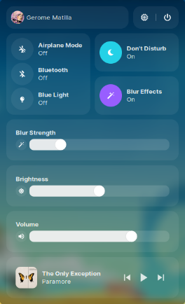
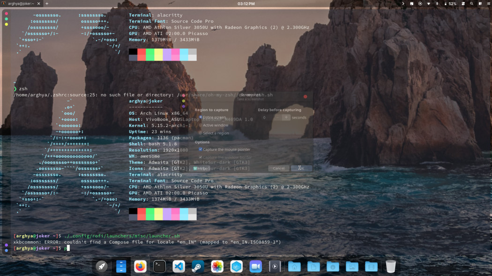
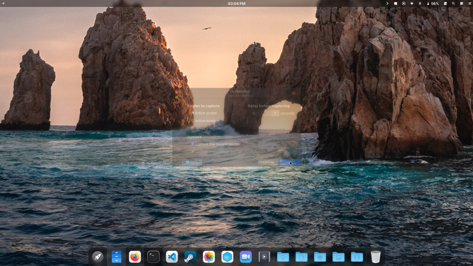
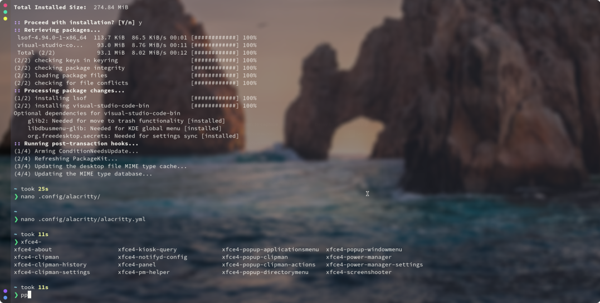
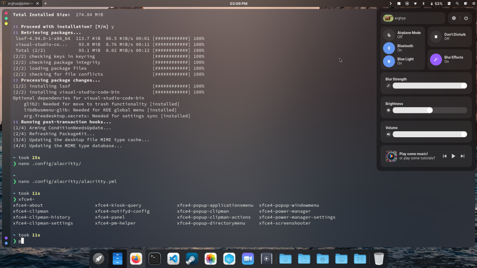

# The Control Center

The Control Center allows you to perform the basic tweaks you would like to do in your OS.

The Control Center can be toggled through the icon in the taskbar

## Usage

Usage is pretty simple. 

### Do Not Disturb [DND]

If On, The Do Not Disturb feature mutes all alerts and notifications on your device.

If Off, The Do Not Disturb feature will stay inactive and you will recieve notifications as usual

### Airplane Mode

When activated, this mode suspends the device's [radio-frequency (RF)](https://en.wikipedia.org/wiki/Radio-frequency) signal transmission technologies (i.e., [Bluetooth](https://en.wikipedia.org/wiki/Bluetooth), telephony and [Wi-Fi](https://en.wikipedia.org/wiki/Wi-Fi)), effectively disabling all analog voice, and digital data services

### Blur Effects

When On, the compositor will force blur the transparent areas of your operating system. For example, your taskbar, terminal, titlebars etc. will get blurred

### Blur Strength Slider

The Blur Strength Slider allows you to adjust the amount of blur you need. It is easily adjustable and very responsive. 

Here are some screenshots of CalinixOS with different blur effects

**No Blur**

**Minimal Blur**

**50% Blur**

**Full Blur**

### Blue Light

We use [Redshift](http://jonls.dk/redshift/) for our blue light filter. Redshift adjusts the color temperature of your screen according to your surroundings. This may help your eyes hurt less if you are working in front of the screen at night. 

Redshift changes the color temperature automatically with the time of the day. 

### Bluetooth

Bluetooth is a standard for the short-range wireless interconnection of cellular phones, computers, and other electronic devices. In Linux, the canonical implementation of the Bluetooth protocol stack is BlueZ. 

You can toggle bluetooth on and off with just one click. 

### Brightness

Adjust your screen brightness through this slider. Moving the slider right increases brightness and moving it right decreases brightness

Brightness is controlled by the [`light-git`](https://github.com/haikarainen/light) application for easily managing brightness levels and display related functions.

### System Resources

In the top right corner of the control center, you will see two buttons. The power button is ofcourse for exiting options, while the left button looking like a CPU toggles the system resources bar which gives you a basic system resource usage overview of your device.