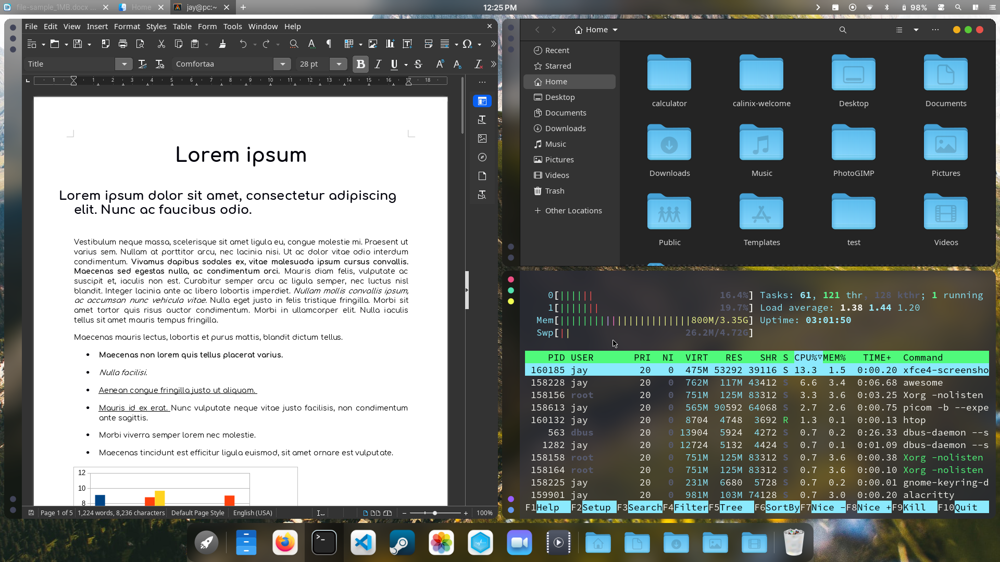

# The Dock

In the CalinixOS UI you will see a dock with several icons and actions below. This section will explain the dock as many people get confused on the dock only. Specially users who were using a DE before

## Apps do not launch when clicking the dock icons!

They won't, because they are not made to. The icons on the dock like that of [Visual Studio Code](https://code.visualstudio.com), [Firefox](https://www.mozilla.org/en-US/firefox/central/), [Steam](https://store.steampowered.com/), [Nautilus](https://gitlab.gnome.org/GNOME/nautilus), [Terminal](https://github.com/alacritty/alacritty) etc.

The Calinix Dock is a bit different from the usual docks. Those application icons there are not for launching the apps. Instead, they are for workspaces. Each application icon represents the workspace of their utility. For example, the firefox workspace is for browsing. The Terminal Workspace is for terminal related tasks, and so on.

## Why so many Workspaces?

Well it's common in tiling window managers. Workspaces make you do your work faster and better. Specially when you are working with many apps at once. And when you are making use of Tiling, it works out better than you would have expected. Tiling uses the whole screen estate of your monitor, hence after 2-3 applications in one window you would want to shift to another workspace. Or most of the time, instead of using multiple floating windows, you would like using one application per workspace due to the easy navigation through keyboard.

You can put the browser on one workspace, the terminal on another, an email client on a third, etc. You can even change the configuration to assign specific applications to particular workspaces and quickly switch between them, which makes workspaces a very useful feature. You can switch workspaces easily, just press `Super+<num>` to go to workspace `<num>`.
