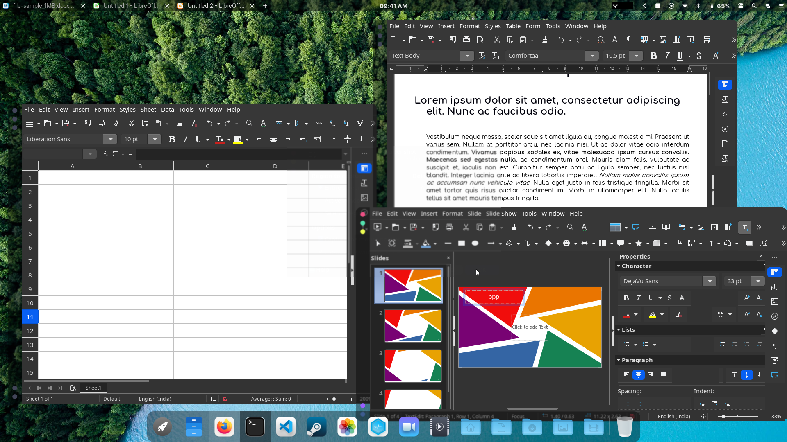

# Getting Started

## Downloading CalinixOS

Every release of CalinixOS is available for download, whether the
current stable release or upcoming preview releases. When you visit
the download page you will find a link to each of the four main
editions , as well as a checksum file for each. A checksum can be
used to check the integrity of the disc image file you download to
make sure it hasn’t been corrupted during the download. 

#### Latest Stable ISO

Navigate to the [Download Page](https://calinix-team.github.io/download.html) of all editions of Calinix. Download the latest stable ISO from the website.

#### Latest Development ISO

We use Github Actions and Artifacts to automate our disc image (ISO) building process. Hence all our latest development ISOs are in our [Actions Page](https://github.com/Calinix-Team/Calinix-Arch/actions). Choose the latest action and in the main page of the specific action, you will find a section called `Artifacts` which stores our ISOs. Simply click the Artifact named `Calinix <Release Tag> DevISO` and a `.zip` archive will start downloading. Extract the archive. The ISO will be present inside the folder

#### Torrents

Our stable releases are hosted as torrents by [FossTorrents](https://fosstorrents.com/). It can be directly downloaded. If you use torrents, you know how to. 

[Download CalinixOS Torrents](https://fosstorrents.com/distributions/calinix-os/)


CalinixOS Alpha 6-4 

## Writing a Disc Image

A disc image is not a copy-and-paste duplication of files: it’s a bit-for-bit copy of the raw data that makes up the files and folders of
that disc. This is why just copying a disc image file to a disc (or USB
flash drive) to begin installing won’t work: you’ll need to use a disc
burning or image writing application to translate that raw data into
the files and folders. 

Once converted, the files can be used to run CalinixOS in LiveCD mode without having to install it to your system, and/or install
CalinixOS on your system. It’s important to note CalinixOS will not have
full functionality when run in Live-CD mode. For example, you will
not be able to save any changes to the system.
Due to the amount of software included on the full edition disc
images you may need to use a DVD instead of a CD.

Many people routinely use a DVD rather than a CD even for the
smallest disc image files. Not only is a DVD faster to burn but they
allow higher data access rates so the Live-CD loads faster and the
installation completes sooner.

#### Burning to a CD/DVD in Linux

If not already installed, several different software burning applications should be available for installation from your distribution’s Software Center / Software Manager / Package Manager / repositories. Popular burners include XFBurn, K3b, and Brasero. Which one you choose is entirely down to personal choice, though your
operating system will usually install one suitable for your desktop environment. To simplify things a little, the following steps for burning your downloaded CalinixOS disc image use [Brasero](https://wiki.gnome.org/Apps/Brasero).

Burning using Brasero
- Insert a blank CD/DVD.
- Start the **Brasero** software burner.
- Click the **Burn Image - Burn an existing CD/DVD image to disc**
button to open the **Image Burning Setup** window.
- Click the button beneath the title **Select a disc image to write** to
open up your file manager. Locate and double-click the downloaded disc image file to load it. Upon automatically returning to
the **Image Burning Setup** window, note that the disc image file is
now listed as the disc image to write.
- The blank CD/DVD you inserted should be automatically listed underneath the title **Select a disc to write** to. If not, click the
button to select it manually.
- Click the **properties** button to open the properties window, and
then click the button beneath the title **Burning Speed**. We strongly
recommend you select the slowest speed available. Once selected,
click the **Close** button. We strongly recommend you select the
slowest speed available when burning
to disc in order minimise the possibility
of corruption during the burning
process.
- Click the **Burn** button to start the burning process. If necessary,
follow any on-screen instructions provided.

#### Burning using Windows Disc Image Burner

Right-clicking on the disc image file and selecting **Burn disc image**
will start the **Windows Disc Image Burner** program. This makes the
process of burning to a disc very straightforward:

- Insert a blank CD/DVD into your disc drive.
- Start **Windows Disc Image Burner**.
- Select your CD/DVD drive in the **Disc burner** menu.
- Click **Burn**.

#### Writing to a USB flash drive in Linux

To take advantage of the faster access times and much quieter nature
of a USB flash drive, there are a number of methods of writing the
disc image file. One of the easiest is to use [SUSE Studio Imagewriter](https://software.opensuse.org/package/imagewriter).

SUSE Studio Imagewriter should be available for installation from
your distribution’s Software Center / Software Manager / Package Manager / repositories. Once SUSE Studio Imagewriter has
been downloaded and installed, ensure that your USB flash drive
is plugged in before starting the application.
The process of using **SUSE Studio Imagewriter** is very straightforward:

- Click on the centre icon.
- Navigate to where you downloaded the disc image file, and select
it.
- Ensure that your USB flash drive has been selected from the dropdown menu.
- Click on the **Write** button.
- Once it has finished, reboot your system, making sure to select the
USB flash drive as the boot device in the BIOS menu (or its UEFI
equivalent).

#### Using the CLI

If you don’t want to install extra software, and you are comfortable
using the command line, there’s an even easier way of writing a disc
image to a USB device.

- Connect the USB flash drive to your PC, open a terminal and `cd` to
where you downloaded the disc image.
- Check the device identifier with: `sudo fdisk -l`.
- Write the image with:

```bash
sudo dd if=path/to/{ISO File} of=/dev/(Device identifier from above) bs=4M
```
My USB drive is at `/dev/sdb` and ISO is at `~/Downloads/Calinix-Arch-21.11.21-x86_64.iso`

So I would use:

```bash
sudo dd if=~/Downloads/Calinix-Arch-21.11.21-x86_64.iso of=/dev/sdb bs=4M
```

- Once completed reboot your system and boot from the USB drive
by selecting it as the boot device in the BIOS menu (or its UEFI
equivalent).

#### Writing to a USB flash drive in Microsoft Windows

##### Rufus

For Windows users using USB media, Rufus
is highly recommended.

- Select the USB key to be used in the Device menu. Then, on the
line beginning with Boot selection, click on Select to select your downloaded disc image, and then Start. After doing so, select DD Image
in the window that appears.
Rufus with recommended settings


##### Etcher
Another recommended piece of software is Etcher. It is incredibly simple to use. All you have to do is select the disc image, the USB
drive, and start flashing the image!


